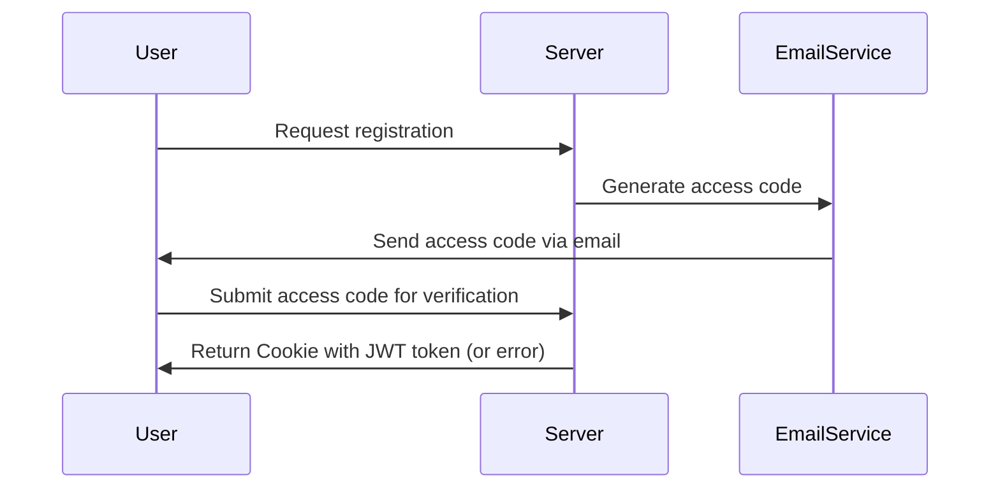
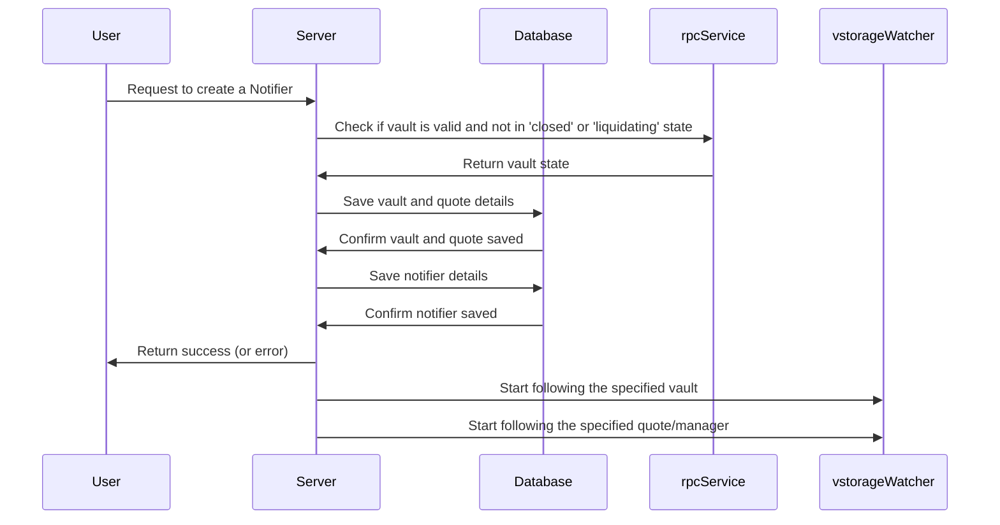
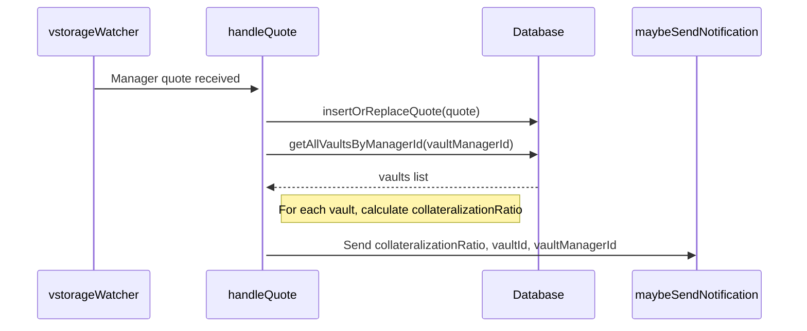
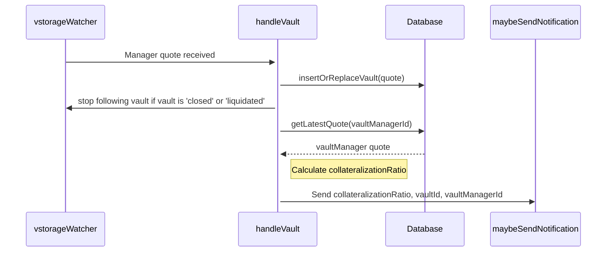
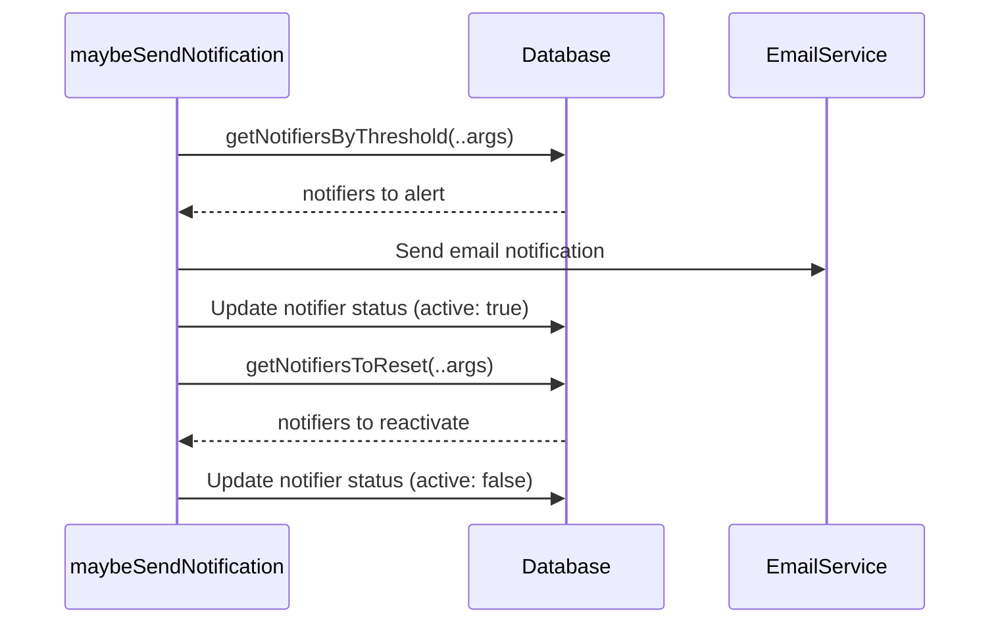
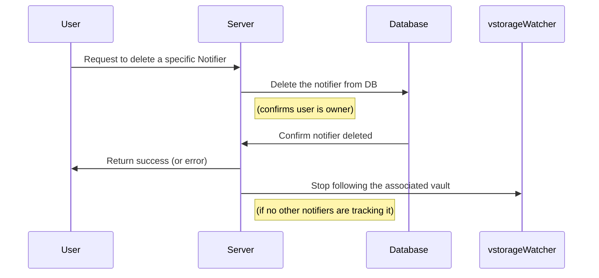

# Sequence Diagrams

## Table of Contents

- [User Registration Flow](#user-registration-flow)
- [Notifier Creation Flow](#notifier-creation-flow)
- [Quote Follower Flow](#quote-follower-flow)
- [Vault Follower Flow](#vault-follower-flow)
- [maybeSendNotifier Flow](#maybesendnotifier-flow)
- [Notifier Deletion Flow](#notifier-deletion-flow)

### User Registration Flow

### Notifier Creation Flow

### Quote Follower Flow

### Vault Follower Flow

### maybeSendNotifier Flow

### Notifier Deletion Flow

